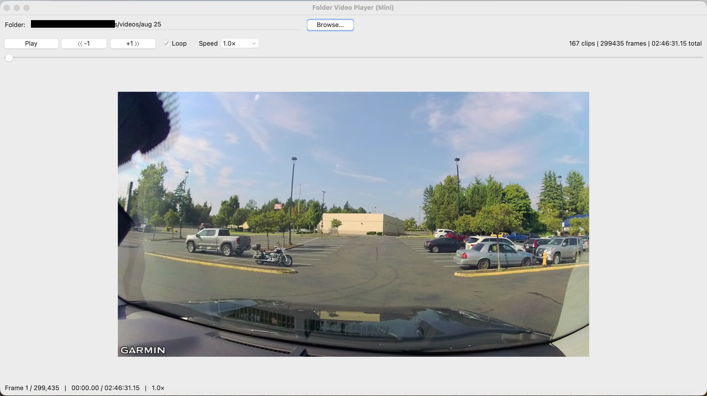

# DashcamTools

>[!NOTE]
>I tested it with my Garmin daskcam's video clips (.mp4/.MP4 format).

## Dashcam Video Clip Viewer

**View the short clips as if a single video file.***

```
python dashcam_clips_viewer.py
```

Then select the folder of the video clips.

### Example Screenshot
<p align='center'>
  
</p>


## Dashcam Video Clip Combiner

**Concatenate the short clips to a single video file.***

```
python concat_video_clips.py
```


## (Optional) Build Executable

You can also build a standalone executable file from the ```.py``` code.

Example:
```
pyinstaller --onefile --noconsole dashcam_clips_viewer.py
```


